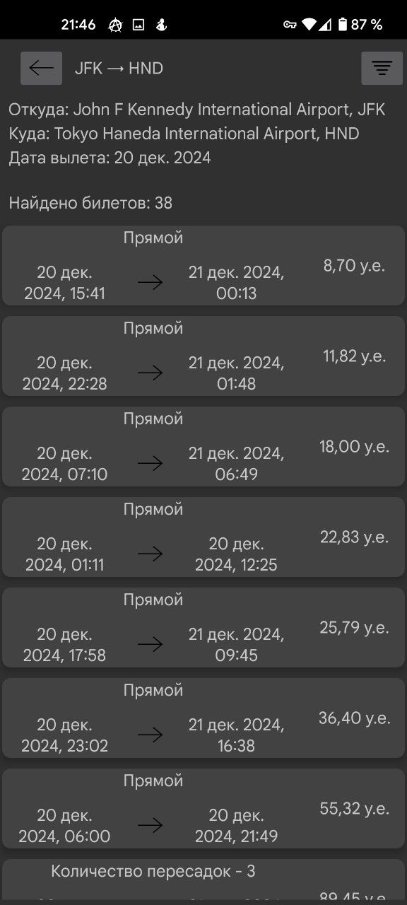
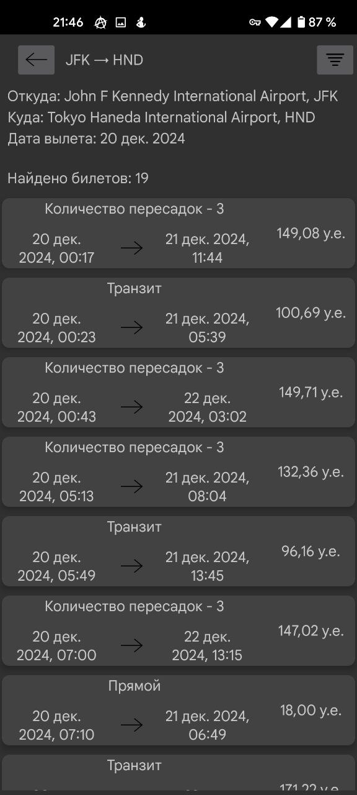
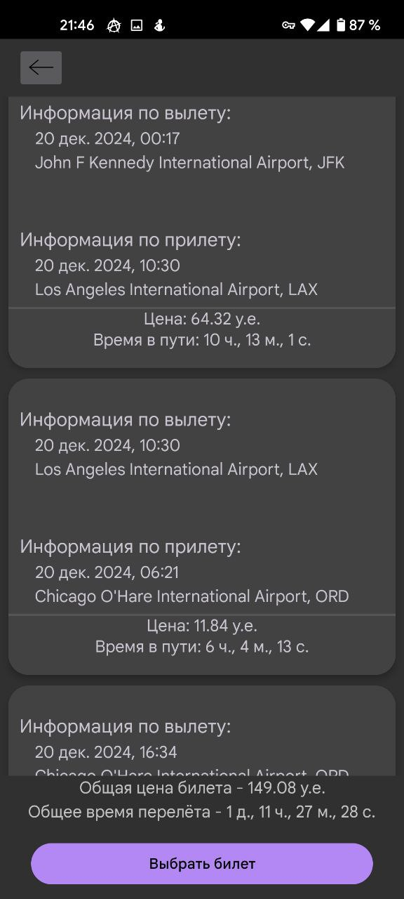
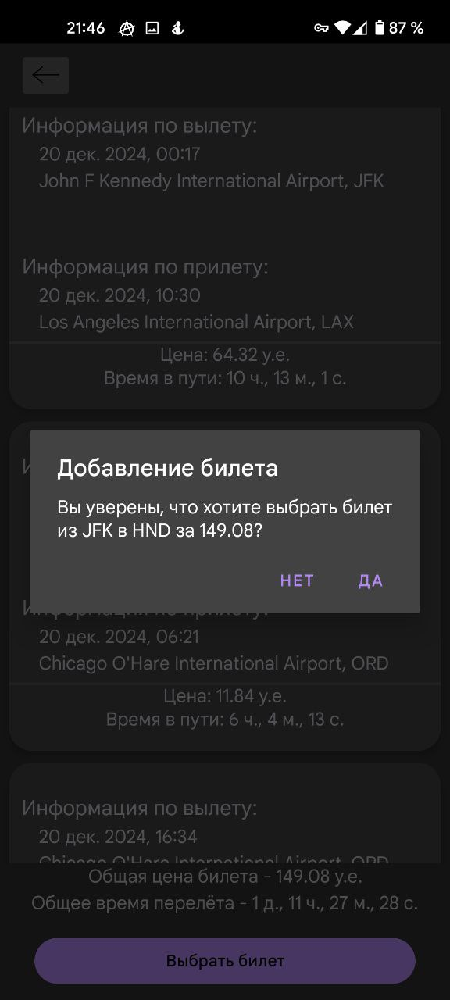

<!-- Table of Contents -->

# :notebook_with_decorative_cover: Table of Contents

- [About the Project](#star2-about-the-project)
    * [Screenshots](#camera-screenshots)
    * [Tech Stack](#space_invader-tech-stack)
    * [Features](#dart-features)
- [License](#warning-license)
- [Acknowledgements](#gem-acknowledgements)

<!-- About the Project -->

# Aviaroute

## :star2: About the Project

Aviaroute is an Android application designed to search for and book flight tickets. It allows users to view available
flight routes, including information such as departure and destination airports, ticket prices, and flight times.

<!-- Screenshots -->

### :camera: Screenshots

## Screenshots

|                                             |                                             |
|---------------------------------------------|---------------------------------------------|
|                      |                      |
| Экран ввода поисковых параметров            | Экран ввода аэропорта                       |
|                      |                      |
| Экран ввода аэропорта                       | Экран выбора даты                           |
|                      |                      |
| Экран выбора даты                           | Заполненные поисковые параметры             |
|                      |                      |
| Заполненные поисковые параметры             | Экран с результатами поиска                 |
|                      |                      |
| Экран с результатами поиска                 | Сортировка списка                           |
|                      |                      |
| Сортировка списка                           | Измененная сортировка списка                |
|                      |                      |
| Измененная сортировка списка                | Экран с результатми поиска после сортировки |
|                      |                     |
| Экран с результатми поиска после сортировки | Полная информация по выбранному билету      |
|                     |                     |
| Полная информация по выбранному билету      | Вы уверены, что хотите купить?              |
|                     |                    |
| Вы уверены, что хотите купить?              | Экран личного кабинета                      |
|                    |                    |
| Экран личного кабинета                      | Сохранённые рейсы                           |

<!-- Features -->

### :dart: Features

- **Flight Search:** Search for available flights between selected departure and destination airports.
- **Flight Information:** View flight details including airline, price, flight time, and flight segments.
- **Route Details:** Browse available flight routes with options to sort flights by timem, price and set optimum ranges
  for it.

<!-- TechStack -->

### :space_invader: Tech Stack

- **[Android SDK](https://developer.android.com/tools/releases/platform-tools)**: Provides the necessary tools and APIs
  for building Android applications.
- **[kotlin](https://kotlinlang.org/)**: Main programming language used for Android development.
- **[Room Database](https://developer.android.com/training/data-storage/room)**: Local database for managing flight and
  airport data with seamless integration into the app.

## Installation

1. Clone the repository:
   ```bash
   git clone https://github.com/aDragon1/Aviaroute.git
2. Have fun with it

## :warning: License

Distributed under the no License. See LICENSE for more information.

<!-- Acknowledgments -->

## :gem: Acknowledgements

- [Readme Template](https://github.com/Louis3797/awesome-readme-template)